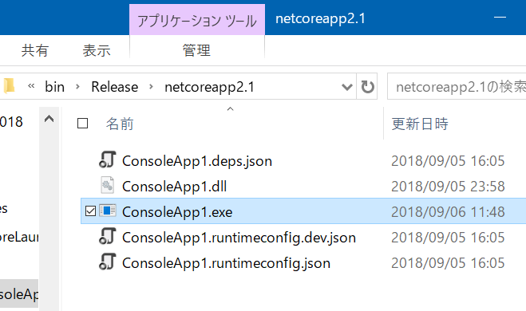

# Tools 2018
The project to create tools.

## .NET Core Launcher
.NET Core Launcher is an executable file on the .NET Framework, to launch a .NET Core app (DLL).  
See [document](https://github.com/sakapon/Tools-2018/wiki/.NET-Core-Launcher).

